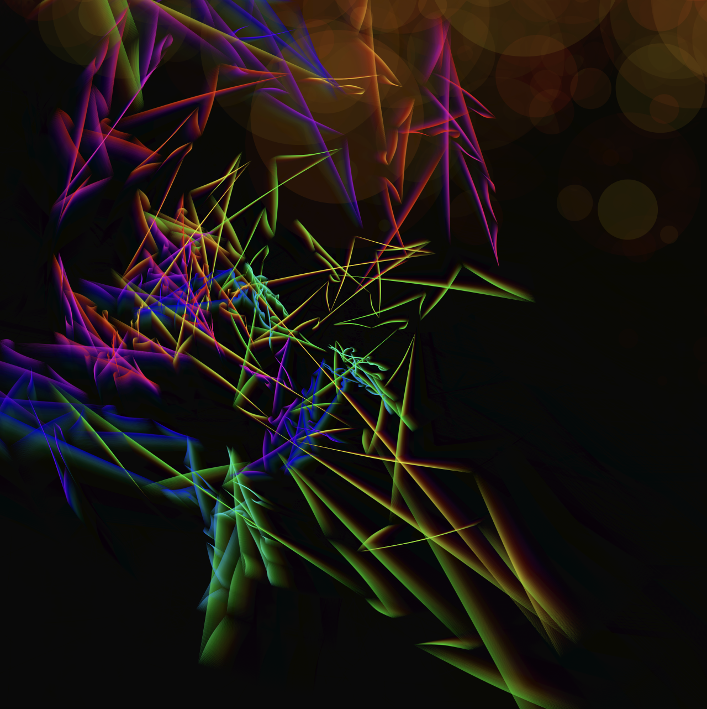

# Fractal-Visualizer


- - -



An web app which visualize fractal shapes.

https://niccari.net/fv/

## URL Parameters

The fractal visualizer supports URL parameters to customize the visualization:

- `depth` - Scroll position (integer, default: 0)
- `seed` - Sets the random seed for reproducible fractal patterns (up to 16 digits positive integer, default: null)

### Examples

```
https://niccari.net/fv/?depth=5
https://niccari.net/fv/?seed=12345
https://niccari.net/fv/?depth=3&seed=98765
```

## LICENSE

MIT License
