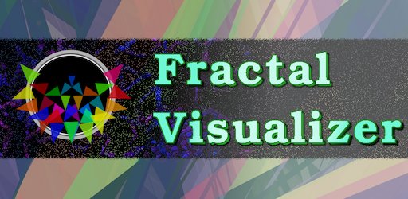
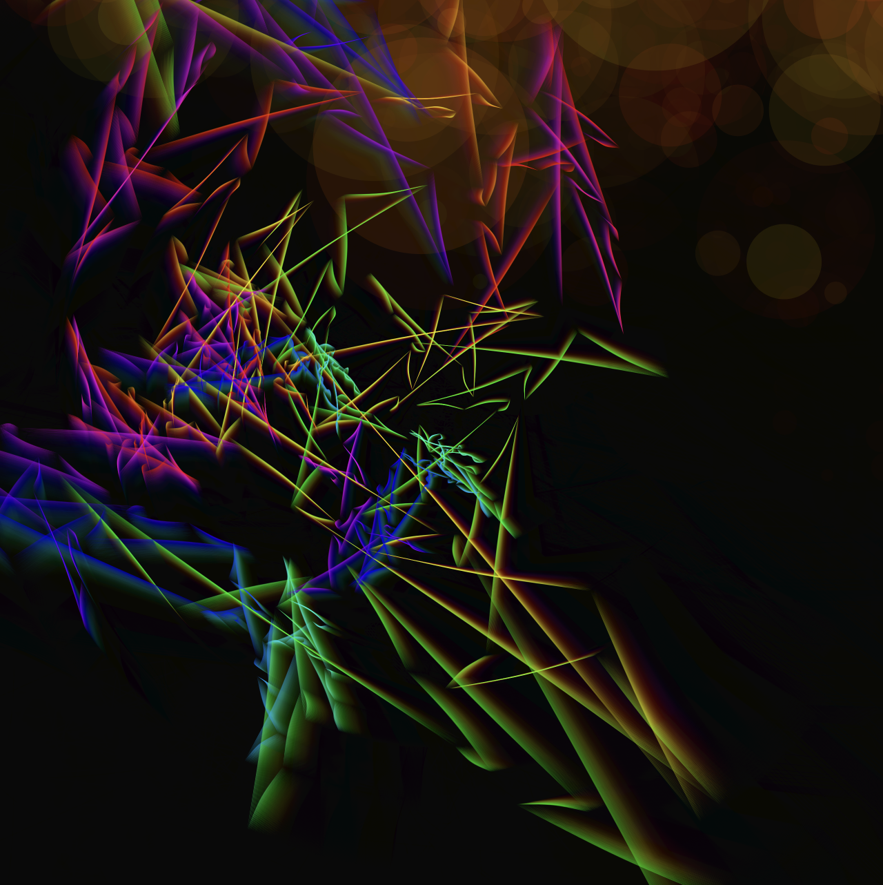

# Fractal-Visualizer



- - -



An web app which visualize fractal shapes.

https://niccari.net/fv/

## Usage

### Built Page

Open the page in a browser. Fractal figures are rendered and animated on the canvas.

To explore different fractal figures, **scroll along the Y-axis** (mouse wheel or touch drag). This shifts the displayed fractal figures vertically, revealing different shapes as you scroll.

You can also share a specific scroll position via URL: the current depth is saved as a `?depth=<value>` query parameter in the address bar after scrolling stops.

### Development

```bash
# Install dependencies
npm install

# Start development server
npm run dev

# Build for production
npm run build

# Preview production build
npm run preview
```

### Code Quality

```bash
# Run linter
npm run lint

# Run linter with auto-fix and formatting
npm run lint:fix

# Run tests
npm test
```

## Fractal Types

The following fractal chart types are supported:

| Kind | Description |
|------|-------------|
| `star` | Star shape |
| `clover` | Clover shape |
| `sunrise` | Sunrise shape |
| `random` | Randomly generated fractal |
| `starmine` | Starmine shape |
| `koch_curve` | Koch curve |
| `koch_triangle_inner` | Koch triangle (inner variant) |
| `koch_triangle_outer` | Koch triangle (outer variant) |
| `fold_dragon` | Dragon curve (paper folding) |
| `fold_ccurve` | C-curve (paper folding) |
| `tri_cis` | Tri cis curve |
| `tri_trans` | Tri trans curve |
| `binary_tree` | Binary tree fractal |

## Architecture

```
src/
├── container.ts          # Dependency injection / app entry
├── visualizer.ts         # Canvas rendering engine
├── view.ts               # DOM & event setup
├── index.ts              # HTML entry point
├── libs/
│   ├── math.ts           # Math utilities (radian/degree conversion)
│   └── collection.ts     # Collection utilities (range)
└── modules/
    ├── randomizer.ts     # Randomization utilities
    └── simulator/
        ├── index.ts      # Animation & scroll simulation
        ├── loader.ts     # Chart config loader
        ├── color.ts      # Color management
        ├── matrix.ts     # Matrix operations
        └── chart/
            ├── models.ts # Data types (Chart, Point, Order, etc.)
            ├── orders.ts # Fractal iteration logic
            ├── points.ts # Point generation & transformation
            └── kinds/    # Individual fractal implementations
```

## LICENSE

MIT License
